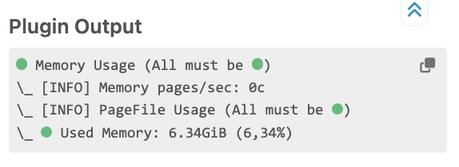
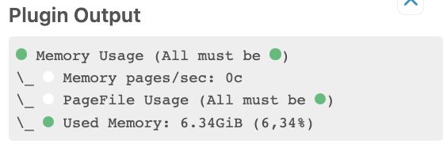

# icingaweb2-module-ifwrenderer
This module adds Powershell Check Rendering improvements to icingadb.
Instead of `[INFO]` which was introduced in the icinga-powershell-framework 1.14.0 there will be a typical ball with the default text color as a background.

## Installation
Use the install command in the release information or install as usual.

This only affects a command that has Invoke-Icinga in the name, like Invoke-IcingaCheckABC or CustomInvoke-IcingaCheckABC

Don't forget to refresh the page (Control Shift R / Cmd Shift R on Mac) otherwise the custom css is not loaded and the is just an empty spot.

## Disabled ifwrenderer

## Enabled ifwrenderer

